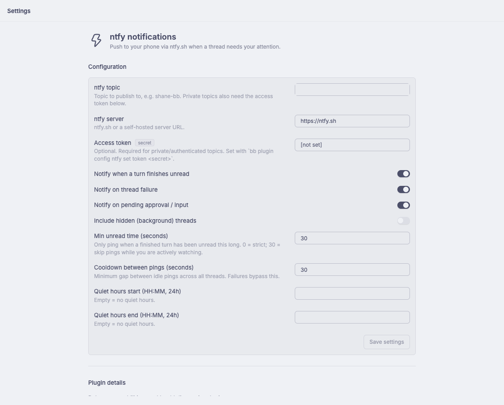

# bb-plugin-ntfy

Push notifications to your phone via [ntfy.sh](https://ntfy.sh) whenever a bb
thread needs your attention.

## Screenshots



*ntfy settings: topic, server, and access token fields.*

## What triggers a notification

| Event | When | Priority |
| --- | --- | --- |
| Turn finished | A thread goes idle with an **unread** result — bb's own attention rule (`latestAttentionAt > lastReadAt`), with a grace window so pings don't fire while you're actively watching | 3 (default) |
| Pending interaction | A thread is waiting on an approval, question, or provider input | 4 (high) |
| Thread failed | A thread transitions into `error` | 4 (high) |

Notifications are deduplicated per (thread, attention moment): a retry that
fails again pings again, but repeat events for the same failure do not.
A global cooldown (default 30s) suppresses back-to-back idle pings across
threads; failures and interactions bypass it. Quiet hours (optional) suppress
everything.

Hidden (background) threads are skipped by default.

## Install

```sh
bb plugin install /Users/shane/Code/bb-plugin-ntfy
```

## Configure

```sh
bb plugin config ntfy set topic shane-bb          # required — your ntfy topic
bb plugin config ntfy set token <access-token>    # optional — private topics
bb plugin reload ntfy
```

Verify end-to-end:

```sh
bb ntfy test --title "Hello from bb"
bb ntfy status
```

You will also get a push on your phone — install the ntfy app and subscribe to
the same topic.

## Settings

| Key | Default | Meaning |
| --- | --- | --- |
| `topic` | — | ntfy topic to publish to (required) |
| `server` | `https://ntfy.sh` | ntfy server (self-hosted supported) |
| `token` | — | access token for private topics (secret) |
| `notifyOnIdle` | `true` | ping when a turn finishes unread |
| `notifyOnFailure` | `true` | ping on thread failure |
| `notifyInteractions` | `true` | ping on pending approval/input |
| `notifyHidden` | `false` | also ping for hidden (background) threads |
| `minUnreadSeconds` | `30` | skip pings for turns unread for less than this — raises the bar so actively-watched turns stay quiet; `0` = strict bb attention semantics |
| `cooldownSeconds` | `30` | minimum gap between idle pings |
| `quietStart` / `quietEnd` | `""` | quiet hours as `HH:MM` (24h); empty disables. Overnight windows (`22:00`–`07:00`) wrap past midnight |

## CLI

```sh
bb ntfy test [--title <text>] [--priority 1-5]   # send a test notification
bb ntfy status                                   # show current configuration
```

## How it works

The plugin listens to the six thread lifecycle events and reacts to
`thread.idle` and `thread.failed`. It uses bb's own attention signal — the
thread DTO's `latestAttentionAt` vs `lastReadAt` timestamps — so "needs
attention" means exactly what the sidebar red dot means. Pending interactions
are checked through `bb.sdk.threads.interactions.list` on idle.

Tapping a notification opens the thread in bb (via the local server's loopback
URL; on a phone that resolves only when bb is reachable on that network).

## Development

```sh
npm install
npm test          # vitest: unit + fake-host integration tests
npm run typecheck # tsc --noEmit
npm run build     # bb plugin build
```
